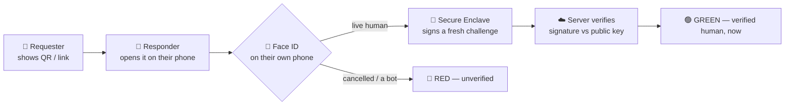

# Realness

**Prove a real, live human is on the other end — right now.**

🔗 **Live:** https://realness.vercel.app · 🎬 **Story demo:** https://realness.vercel.app/story · 🔒 WebAuthn / passkeys · 📱 PWA

A polished profile, website, search results, even voice and video can be faked by AI. The one thing that can't: a live human proving it on their own device, this second. Realness is that proof.

## Why this matters

AI can now spin up a flawless stranger — face, voice, history, a warm DM — at near-zero cost and infinite scale. "Looks real" is no longer evidence of anything.

- **Fake VCs & recruiters** open doors, then steal data, money, or a meeting that was never real.
- **Deepfaked execs** authorize wire transfers; **romance & support-desk scams** social-engineer their way past every "verify yourself" check.
- Every inbound message now carries a quiet tax: *am I even talking to a person?*

When faking presence is free, the only question worth answering is: **is a real, live human actually here, right now?**

## How it works

Two phones, one live handshake: the Requester shows a one-time link/QR, the Responder proves they're real with their own biometric, and the Requester's screen blooms green — or stays red.

## Why it's private

- The **private key never leaves the phone's Secure Enclave** — non-exportable, never shown, never sent.
- Only a **public key** (once) and **one-time signatures** over fresh random challenges ever travel.
- We store **no biometric and no PII** — just `{ publicKey, counter }`.

## Why a bot can't pass

A bot or remote-control session can tap the button, but it can't present a live face — so the Enclave never signs → red. That kills remote, scalable AI fraud.

**Honest boundary:** a real human holding your unlocked phone (theft + passcode) is device compromise — the same limit as Apple Pay or any passkey; it doesn't scale the way AI fraud does.

## Stack

| | |
|---|---|
| **Frontend** | Single-file vanilla-JS SPA, dark "Aurora Bloom" UI, PWA |
| **Backend** | Vercel serverless (`api/`) · `@simplewebauthn/server` |
| **Store** | Upstash Redis — shared session + enrolled public keys |

## Scope

**✓ In:** live human-presence proof (remote) · on-device biometric · designed green/red states · QR + link handshake · PWA
**✕ Out:** accounts, revocation, multi-device · deepfake/video, AI-detection scoring · any LLM call
